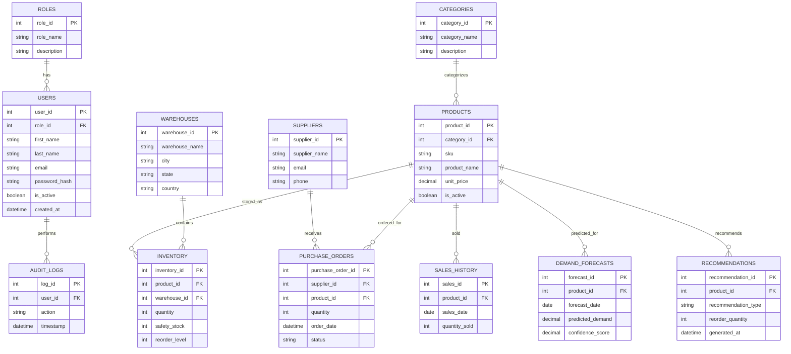

# Phase 4.4.2 – Entity Relationship Diagram (ERD)

> **Project:** AI Inventory Decision Intelligence Platform

---

# Overview

The Entity Relationship Diagram (ERD) defines the logical relationships between the core entities of the AI Inventory Decision Intelligence Platform.

The database follows a normalized relational model designed to support inventory management, procurement, demand forecasting, recommendation generation, and enterprise reporting.

---

# Core Entities

- Users
- Roles
- Categories
- Products
- Warehouses
- Inventory
- Suppliers
- Purchase Orders
- Sales History
- Demand Forecasts
- Recommendations
- Audit Logs

---

# Entity Relationship Diagram

---

# Relationship Summary

| Parent Entity | Child Entity | Relationship |
|---------------|-------------|--------------|
| Roles | Users | One-to-Many |
| Categories | Products | One-to-Many |
| Products | Inventory | One-to-Many |
| Warehouses | Inventory | One-to-Many |
| Suppliers | Purchase Orders | One-to-Many |
| Products | Purchase Orders | One-to-Many |
| Products | Sales History | One-to-Many |
| Products | Demand Forecasts | One-to-Many |
| Products | Recommendations | One-to-Many |
| Users | Audit Logs | One-to-Many |

---

# Database Design Notes

- Every table has a Primary Key.
- Foreign Keys enforce referential integrity.
- Business entities are normalized to Third Normal Form (3NF).
- Timestamp fields are included where operational tracking is required.
- The design supports future extensions such as multi-warehouse management, multi-tenant deployments, and advanced analytics.

---

# Conclusion

This ER Diagram represents the logical data model of the AI Inventory Decision Intelligence Platform. It defines the relationships among business entities and serves as the blueprint for SQL schema creation, SQLAlchemy models, REST API implementation, and Machine Learning data pipelines.